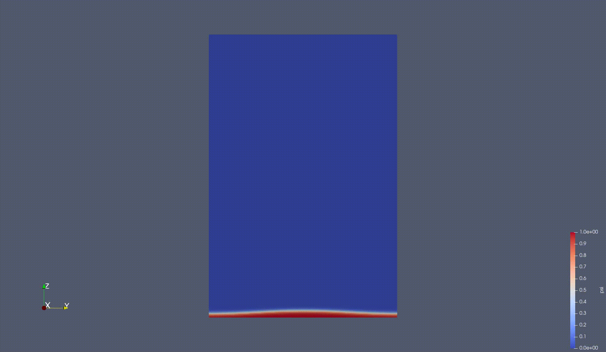
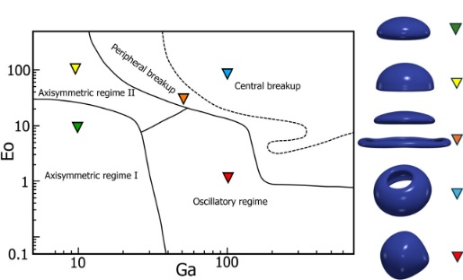
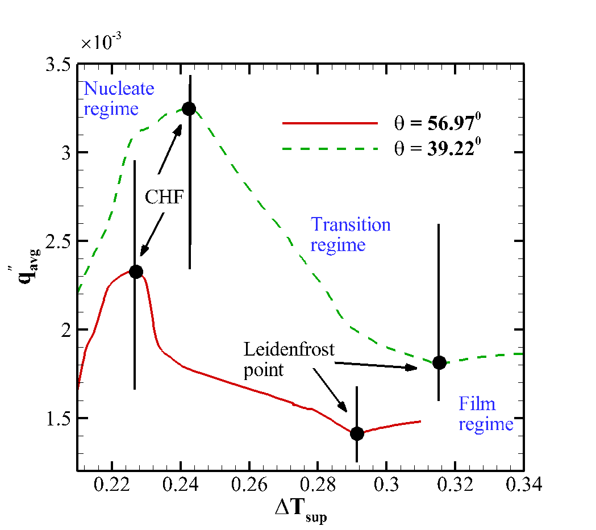
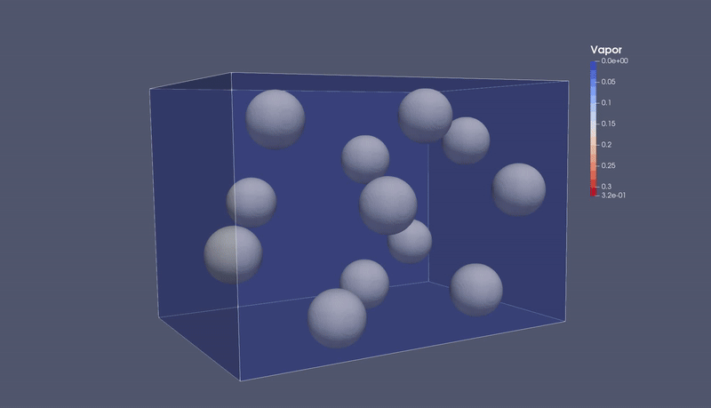

[Home](index.html) | [Projects](projects.html) | [Publications](publications.html) | [Skills](skills.html) | [Contact](contact.html)

<!-- Page Title -->
<h1 style="font-size:28px; font-weight:bold; margin-bottom:20px;">
  Projects
</h1>

  Interested in my work? Check my <a href="skills_education.html">Skills & Education</a> or <a href="contact.html">Contact me</a> to discuss potential collaboration.

<h3 style="margin-top:40px; margin-bottom:15px; font-weight:bold;font-size:20px;">
  Development of a Finite difference–based Diffused Interface phase-change solver
</h3>

  <!-- Text column -->
  

    <ul>
      <li>Developed MPI parallelized phase-changing FDM multiphase solver based on open source code FluTAS</li>
      <li>Worked on a diffuse interface algorithm that works accurtaely for boiling and evaporation problems </li>
      <li>Simulated scalar transfer from mulitple bubbles for industrial gas transfer applications</li>
    </ul>
  

  <!-- Image column -->
  

    <figure>
      
      <figcaption style="text-align:center; font-size:14px; color:#555; margin-top:5px;">
        Film boiling from a plain surface
      </figcaption>
    </figure>
  

<h3 style="margin-top:40px; margin-bottom:15px; font-weight:bold;font-size:20px;">
  DNS studies of multiphase flows with mass-transfer multiple droplet/bubble in turbulent suspensions
</h3>

  <!-- Text column -->
  

    <ul>
      <li>Developed MPI parallelized phase-changing FDM multiphase solver based on open source code FluTAS</li>
      <li>Worked on a diffuse interface algorithm that works accurtaely for boiling and evaporation problems </li>
      <li>Simulated scalar transfer from mulitple bubbles for industrial gas transfer applications</li>
    </ul>
  

  <!-- Image column -->
  

    <figure>
      
      <figcaption style="text-align:center; font-size:14px; color:#555; margin-top:5px;">
        Film boiling from a plain surface
      </figcaption>
    </figure>
  

<h3 style="margin-top:40px; margin-bottom:15px; font-weight:bold;font-size:20px;">
  Development of a LB Diffused Interface solver for multiphase flow
</h3>

  <!-- Text column -->
  

    <ul>
      <li>Contributed to the OpenACC-GPU parallelized phase-field LB multiphase solver accLB</li>
      <li>Captured all bubble shapes seperately for a bubble rise problem </li>
      <li>Studied multiple droplets faliing  on a surface with different wettability</li>
      <li>Captured on and of-axis collision of water droplets in air</li>
      <li>Implementing phase-change to the solver </li>
    </ul>
  

  <!-- Image column -->
  

    <figure>
      
      <figcaption style="text-align:center; font-size:14px; color:#555; margin-top:5px;">
        Different bubble shapes with Eotvos and Galilei number
      </figcaption>
    </figure>
  

<h3 style="margin-top:40px; margin-bottom:15px; font-weight:bold;font-size:20px;">
  Multiphase Lattice Boltzmann Solver Development for Phase-Change on Structured Surfaces
</h3>

  <!-- Text column -->
  

    <ul>
      <li>Developed OpenMP parallelized phase-changing LB multiphase solver</li>
      <li>Augmented the existing algorithm to simulate high density ratio problems, simulated all boiling regimes to plot the whole boiling curve on plain and structured surfaces with different wettability</li>
      <li>Simulated flow boiling in a narrow channel - captured bubbly and slug flow regimes</li>
      <li>Simulated condensation in micro/nano structured surfaces - captured Cassie and Wenzel droplet generation modes</li>
    </ul>
  

  <!-- Image column -->
  

    <figure>
      
      <figcaption style="text-align:center; font-size:14px; color:#555; margin-top:5px;">
        Boiling curve in surfacs with different wettability
      </figcaption>
    </figure>
  

<!-- Project 2 -->

  

    <h3>Thermal Flow Modelling</h3>
    <ul>
      <li>Applied FDM and FVM for thermal-fluid simulations</li>
      <li>Analyzed thermal transport and interfacial phenomena</li>
    </ul>
  

  

    
  

<!-- Project 3 -->

  

    <h3>HPC & Solver Optimization</h3>
    <ul>
      <li>Implemented MPI, OpenMP, and GPU-based solvers for large simulations</li>
      <li>Optimized computation for faster turnaround on multiphase problems</li>
    </ul>
  

  

    
  

<!-- Project 4 -->

  

    <h3>Data-Driven Surrogate Modelling</h3>
    <ul>
      <li>Generated datasets from high-fidelity solvers</li>
      <li>Trained NN surrogates for equation-of-state replacement in OpenFOAM</li>
    </ul>
  

  

    
  

  More projects, publications, and details can be found on my <a href="skills_education.html">Skills & Education</a> page or by <a href="contact.html">contacting me</a>.

### **Non-Fourier Heat Conduction and radiation**

### **Development of a Multiphase Lattice Boltzmann Solver to Explore Boiling and Condensation processes**

### **Validation and testing of the WRF-SFIRE framework for real-time wildfire spread** 

### **Development of a Finite difference–based Diffused Interface phase-change solver**
.gif)
### **DNS studies of phase-changing flows with multiple droplet/bubble in turbulent suspensions**

### **Development of accLB, a Multiphase Lattice Boltzmann solver parallelized using CUDA/OpenACC and MPI**

### Multiphase Boiling Simulation (PhD)

- Multiphase boiling and evaporation simulation  
- LBM / FVM based solver  
- Focus on interfacial heat and mass transfer  
- Post-processing using ParaView

